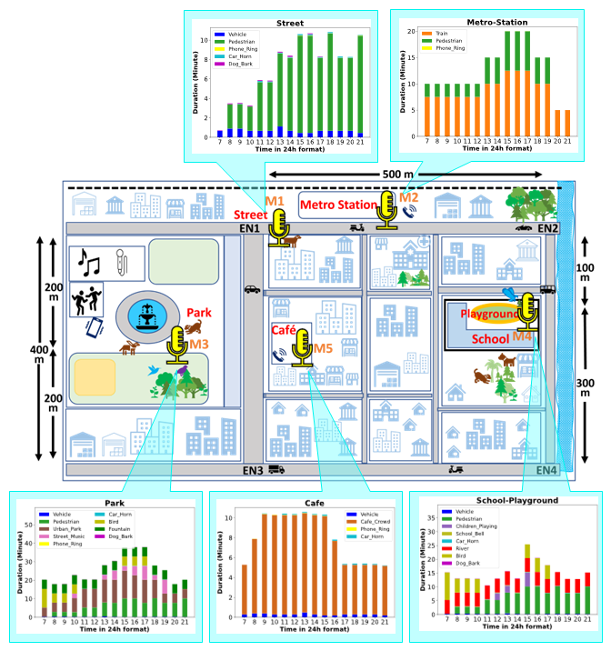

# STeLiN-US Database

## Download Link
[STeLiN-US Database](https://zenodo.org/records/8241539)\
Dataset is of 4.0 GB in size, can be downloaded in zip file from above link.


## Created by
**Snehit Chunarkar, Bo-Hao Su, Chi-Chun Lee**\
Department of Electrical Engineering, National Tsing Hua University, Taiwan


## Introduction
Spatio-temporally Linked Neighborhood Urban Sound (STeLiN-US) database is semi-synthesized, that is, each sample is generated by leveraging diverse sets of real urban sounds with crawled information of real-world user behaviors over time.

## Aim
We proposed this dataset with the inspiration to equip researchers with variable surrounding sound in an environment that closely resembles realistic patterns. 
The proposed STeLiN-US dataset simulates the acoustic appearance of closely interconnected neighborhoods in urban areas. 
1.	Possess potential in not only identifying the scenes. 
2.	This accommodates the user-centered applications, e.g., If combined with the ASR, the ASR performance can be analyzed based on the location and time more than that possible performance can be predicted beforehand based on the prediction of the scene busyness.
3.	Incorporation of scene-specific events to replicate the real surrounding environments facilitates researchers in testing trailblazing event detection systems.

## Synthesis Procedure
We propose a map with the mentioned microphone locations which represent the scene as below. 


This map also forms a base to make the interconnection using the vehicle sound, with mentioned distances for microphones from each other and speed of the vehicles for each clip from IDMT dataset helps to form a robust interconnection. 
Sound events Vehicle, Car Horn, Street Music, Pedestrian, and Dog Bark follows the real surrounding pattern of presence of events from the [SONYC](https://dcase.community/challenge2020/task-urban-sound-tagging-with-spatiotemporal-context "SONYC") study. And background sound Metro Station, Park, and Cafe follows the google maps popular time index using [LivePopularTimes](https://github.com/GrocerCheck/LivePopularTimes.git "LivePopularTimes") python package 

## Dataset Specification:
STeLiN-US dataset is consisting of 5 minutes audio segments representing 5 acoustic scenes or microphone locations:
1.	Street
2.	Metro-Station
3.	Park
4.	School-Playground
5.	Café

Audio segment at each scene is synthesized for 15 discrete hours of the day from 7am to 9pm, equally distributed for each day of the week from Monday to Sunday. For 5 locations on 7 days with 15 discrete timestamps representing each audio segment accumulate to 525 total audio segments representing 43 hours 45 minutes of duration. 
We use 14 acoustic sound classes divided into event and background as below:

|Events	|Backgrounds|
|-------|-----------|
|Vehicle, Children Playing, Street Music, Phone Ring, School Bell, Car Horn, Bird, and Dog Bark	      |Train, Pedestrian, Cafe Crowd, Urban Park, River, and Fountain

Sound Classes and Dataset used for the synthesis:

|Sound Class	                 |Source Dataset|
|-------------                 |--------------|
|Vehicle	                     |  [IDMT Traffic](https://doi.org/10.48550/arXiv.2104.13620 "IDMT")|
|Train, Cafe Crowd, Urban Park |	[TUT Rare Sound Events 2017](https://doi.org/10.5281/zenodo.401395 "TUT Rare Sound 2017")|
|Pedestrian                    |	[TAU Urban Acoustic Scenes 2020 Mobile](https://doi.org/10.5281/zenodo.3819968 "TAU Scene 2020")|
|Children Playing, Street Music|	[UrbanSound](https://doi.org/10.1145/2647868.2655045 "UrbanSound")|
|Phone Ring                    |	[NIGENS](https://doi.org/10.48550/arXiv.1902.08314 "NIGENS")|
|School Bell, River, Fountain  |	[FreeSound](https://freesound.org/ "freesound")|
|Car Horn, Dog Bark            |	[UrbanSound8K](https://doi.org/10.1145/2647868.2655045 "UrbanSound")|
|Bird                          |	[ESC-50](https://www.karolpiczak.com/papers/Piczak2015-ESC-Dataset.pdf "ESC-50")|


## Naming Convection
```[Day]_[Microphone Location/Scene]_[Time].wav```
e.g. “Mon_Park_3pm.wav” represent Park scene on Monday synthesized at 3pm


## Metadata
STeLiN-US is enriched with the event’s strong labels in “MetaData.xlsx” file. 
1st columns represent wavefile name followed by each 2 set of columns for each event from which 1st represent the number of each specific event and 2nd of which represents a list containing single or multiple list which mention the time in milliseconds of occurrence of the event specified in column. 

e.g.
|Wavefile|	Vehicle|  	Vehicle [Tstart Tend]    |	…| Dog_Bark|	Dog_Bark [Tstart Tend]|
|---|---|---|---|---|---|
|Sun_Park_9am.wav|	7|	[[114400, 116400], [139000, 141000], [23400, 25400], [101400, 103400], [94286, 96286], [91400, 93400], [139400, 141400]]|	…|	2|	[[184933, 185203], [11099, 11506]]|


This example represents “Sun_Park_9am.wav” contain 7 vehicle sound event each with their start and end time in milliseconds (as one vehicle sound [Start time, End time] = [114400, 116400]). Similarly same file contains 2 Dog barks sound events with the mentioned start and end time following the same logic.


## Temporal Metadata
A track of vehicle sounds is traced at each microphone location which is compiled into “Traffic_Temporal_MetaData.xlsx”.

e.g.
|Wavefile        |	IDMT_File   |	[Tstart Tend]|
|--------        |-----------   |---------------|
|Mon_Park_7am.wav|	2019-11-13-08-00_Schleusinger-Allee_70Kmh_2262920_M_W_CL_SE_CH34.wav|	[13286, 15286]|

Above table represent the mentioned IDMT file present in “Mon_Park_7am.wav” sound segment in timestamp [13286 to 15286] in milliseconds.


## File Structure
```
STeLiN-US
|    MetaData.xlsx
|    Traffic_Temporal_MetaData.xlsx
|
|____Readme
|    |    README.md
|    |    Map_Paper.png
|
|
|____Audio
|    |____Street
|    |    |    Fri_Street_1pm.wav            file naming convection: [Day]_[Microphone Location/Scene]_[Time].wav
|    |    |    Fri_Street_2am.wav
|    |    |    …
|
|    |____Metro-Station
|    |    |    Fri_Metro-Station_1pm.wav
|    |    |    Fri_Metro-Station_2pm.wav
|    |    |    …
|
|    |____Park
|    |    |    Fri_Park_1pm.wav
|    |    |    Fri_Park_2pm.wav
|    |    |    …
|
|    |____School-Playground
|    |    |    Fri_School-Playground_1pm.wav
|    |    |    Fri_School-Playground_2pm.wav
|    |    |    …
|
|    |____Cafe
|    |    |    Fri_Cafe_1pm.wav
|    |    |    Fri_Cafe_2pm.wav
|    |    |    …

```

## Feedback
This is preliminary work, and We look forward to improving the present version of the dataset. Suggestions on this are most welcome by sending your feedback to:
* Snehit Chunarkar: snehitc@gmail.com 

## Acknowledgement
The work was supported by the National Science and Technology Council (NSTC), Taiwan.
