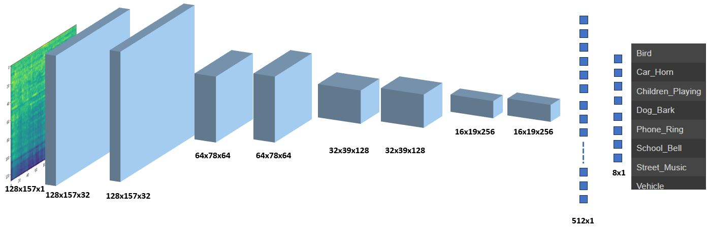

# SED

## polyphonic metadata
use df_polyphonic_meta.py to generate df required for the SED dataloader.
| Index | Wavefile	| Events | Clip |
|-------|-------|-----------|-----------|
| 0 | Fri_Cafe_10am.wav | [Car_Horn, Vehicle] |	(14093, 19093) |
| 1 | Fri_Cafe_10am.wav |	[Vehicle] |	(26971, 31971) |
|...|...|...|...|
| 12105 | Wed_Street_9pm.wav |	[Vehicle]	| (127753, 132753) |
| 12106	| Wed_Street_9pm.wav	| [Phone_Ring] |	(280176, 282176) |

## Baseline
The baseline for STeLiN-US is the CNN as shown in the figure below, where the mel-spectrogram is used as input to the model and 8 output linear layer for predicting 8 Events. 

## Results
Under work
