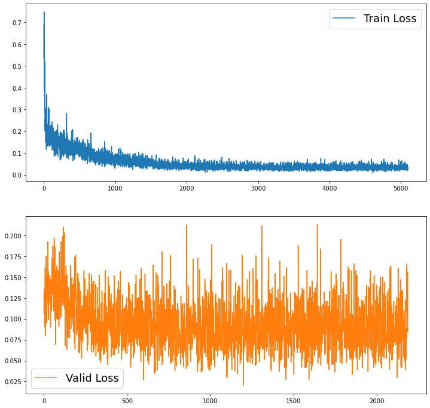

# SED

## Polyphonic metadata
Use ```df_polyphonic_meta.py``` to generate df required for the SED dataloader or the User can directly use ```df_polyphonic_meta.pkl``` file to get the following dataframe. Note that the pickle file (```.pkl```) retains the data type in df while loading, which is not the case with the ```.xlsx``` file; hence ```.pkl``` format is recommended.

```df_polyphonic_meta.pkl``` having the data as follow
| Index | Wavefile	| Events | Clip |
|-------|-------|-----------|-----------|
| 0 | Fri_Cafe_10am.wav | [Car_Horn, Vehicle] |	(14093, 19093) |
| 1 | Fri_Cafe_10am.wav |	[Vehicle] |	(26971, 31971) |
|...|...|...|...|
| 12105 | Wed_Street_9pm.wav |	[Vehicle]	| (127753, 132753) |
| 12106	| Wed_Street_9pm.wav	| [Phone_Ring] |	(280176, 282176) |

## Baseline
1. **Model:** The baseline for STeLiN-US is the CNN, with 8 conv layer with ReLU followed by 1 linear layer with ReLU and a final linear layer with Sigmoid as shown in the figure below.
2. **Input:** Mel-spectrogram (128x157)
3. **Output:** Tensor of length 8 with binary values 0 or 1 indicating if the particular event is present or not.

 

## Results
Trained for 30 epochs, here we considered the Accuracy and Recall Score (macro) on the validation set to examine the performance for the current SED task.\

 


